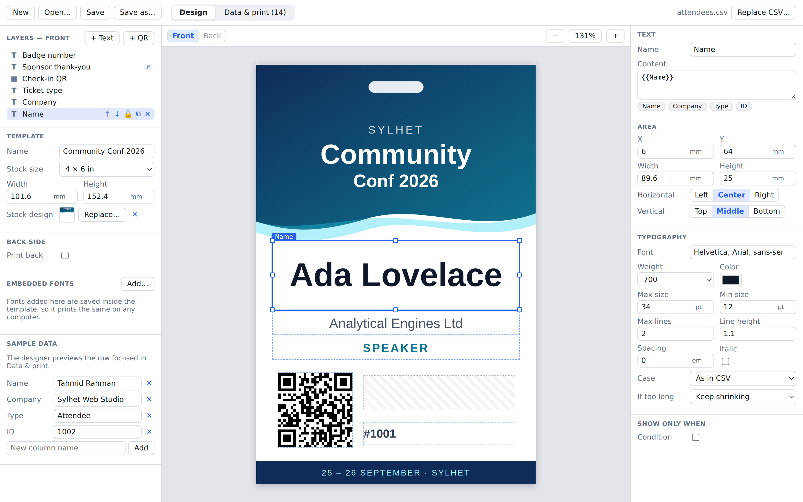
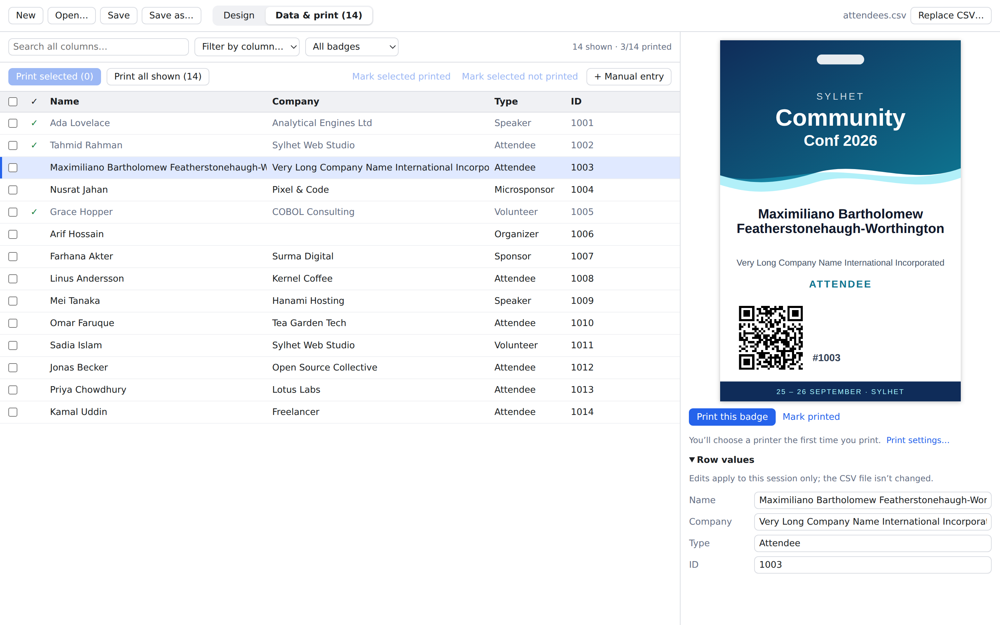
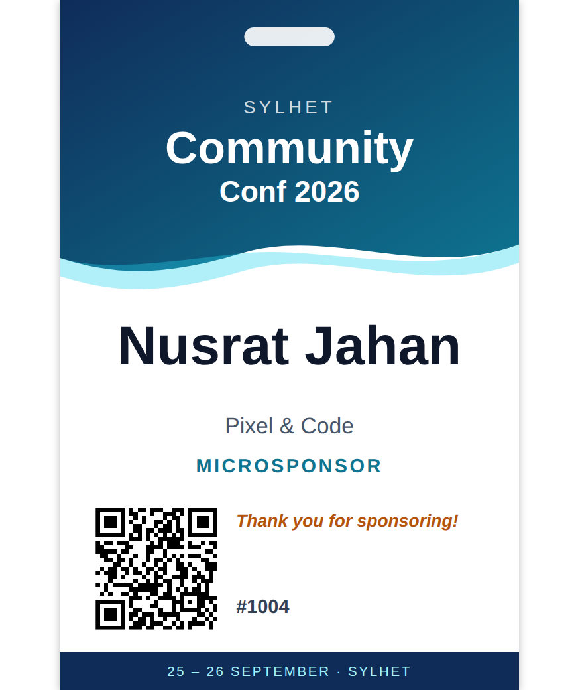
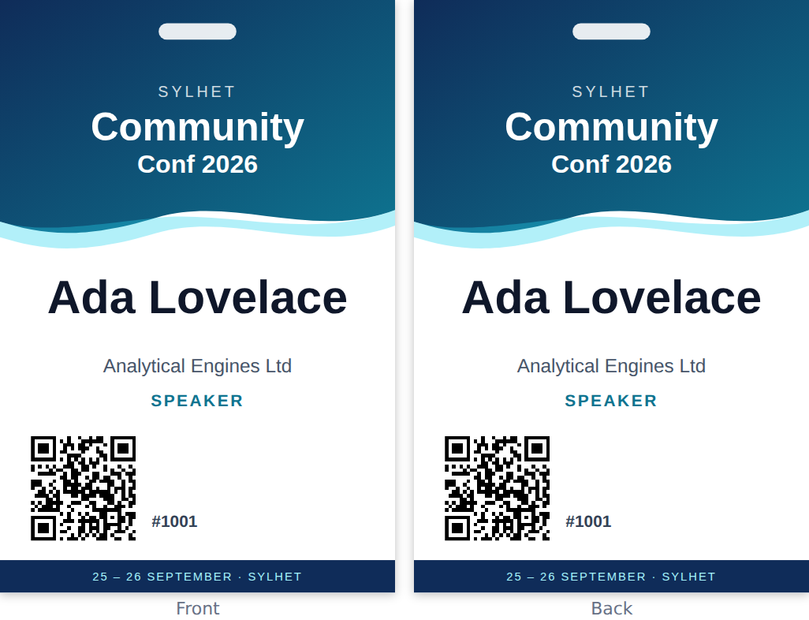
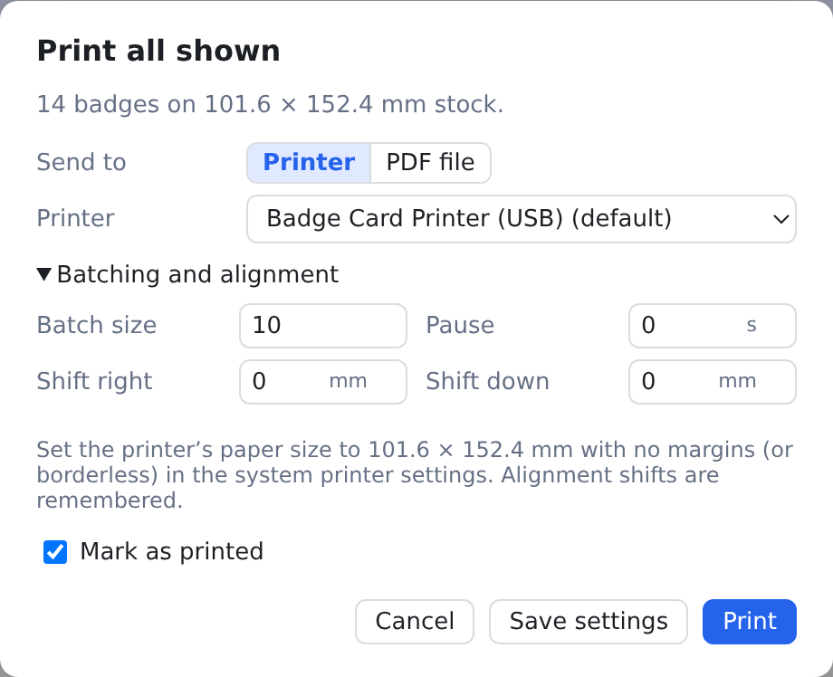

# Badge Printer

A desktop app for printing event badges in bulk from a CSV file onto **pre-printed badge stock**.

Design where each attendee's details go on your stock, load the attendee list, and print one badge or hundreds.



## Features

### Design placements on your stock

- Load a picture of your badge stock as a guide, then draw placeholder boxes on it. The stock picture is **never printed**; it is only there so you can line things up.
- A text placeholder holds `{{Column Name}}` tokens that are filled from the CSV column of the same name. You can mix in plain text, e.g. `{{First}} {{Last}}` or `#{{ID}}`. Click a column chip to insert its token.
- Each box is the area the text may grow into. You choose:
  - horizontal and vertical alignment
  - **max and min font size**; text gets as big as the box allows, up to the max
  - max lines, weight, colour, italics, case, letter spacing and line height
  - what happens if it still doesn't fit: keep shrinking, cut off with …, or clip
- **QR codes** get their content from columns too, e.g. `https://example.com/checkin/{{ID}}`.
- **Conditional fields** show only when a column matches a rule, e.g. a thank-you note only when `Type` contains "sponsor".
- Snapping guides, arrow-key nudging, locking, layers, and undo/redo.
- Templates save as a single `.badge` file holding the layout, the stock images and any embedded fonts, so a template prints the same on any computer.

### Browse attendees with a live preview



- Move through the list with the arrow keys and the badge beside it follows. Long names shrink and wrap to fit, and a warning appears if text can't fit even at the minimum size.
- <kbd>Space</kbd> selects a row and <kbd>Enter</kbd> (or a double-click) prints it.
- Search all columns, filter by any column's values, or show only badges not printed yet.
- Printed badges are ticked off, so it's easy to pick up where you left off or reprint one.
- Fix a typo in a row or add a walk-in attendee without editing the CSV.
- If the CSV's headers differ from the ones the template uses, pick which column to use instead.

| Conditional field (sponsors get a thank-you note) | Optional back side, printed in fold mode |
|---|---|
|  |  |

### Print in batches



- Badges go to the printer in small batches, 10 by default. Only one batch is laid out and spooled at a time, so neither the printer's memory nor the computer's fills up on a large run. An optional pause between batches lets slow printers catch up.
- A run can be cancelled partway through. Each badge is marked printed as its batch goes out.
- **Fold mode** prints the back on the same piece of stock, either below the front (turned 180° so it reads upright once folded) or beside it. The back can repeat the front or have its own layout.
- **Alignment shift**: nudge everything by fractions of a millimetre to line up with the pre-printed stock. The shift is remembered.
- **Export to PDF** instead of printing, built from the same batches.

## Install

Download the installer for your system from the [latest release](https://github.com/haqadn/badge-printer/releases/latest). It runs on Windows 10 or later (64-bit), macOS on Apple Silicon, and 64-bit Linux.

The installers aren't signed with a paid developer certificate yet, so the first launch shows a warning:

- **Windows:** on the SmartScreen prompt, click **More info → Run anyway**.
- **macOS:** after dragging the app to Applications, right-click it and choose **Open**, or go to **System Settings → Privacy & Security** and click **Open Anyway**.

## Try it with the example

`examples/community-conf/` has a sample template (`community-conf.badge`), the stock design it was made for, and an attendee list (`attendees.csv`). Open the template with **Open…**, then load the CSV with **Load CSV…**.

### Printing tips

Set the printer's paper size to the stock size (doubled in fold mode) with no margins. Print one sample badge on plain paper, hold it against a piece of stock, and correct any offset with **Batching and alignment → Shift right / Shift down** in the print dialog.

## Development

```bash
npm install
npm run dev        # run the app with hot reload
npm test           # unit tests
npm run typecheck
npm run dist       # build an installer for the current OS into dist/
npm run build:example   # rebuild examples/community-conf/community-conf.badge
npm run build && npm run screenshots   # regenerate docs/screenshots (use xvfb-run -a on a headless Linux box)
```

Built with Electron, React, TypeScript and electron-vite.

### Layout

| Path | What it holds |
|---|---|
| `src/shared/` | Template types, placeholder filling and conditions, batching. Used by both processes. |
| `src/main/` | Electron main process: file dialogs and the batched print-job runner (`jobs.ts`). |
| `src/preload/` | The small API the page can call (`window.badge`). |
| `src/renderer/src/badge/` | Draws a badge. The same component is used for the designer, the preview and the print window, so what you see is what prints. `fit.ts` does the auto-fit text sizing. |
| `src/renderer/src/designer/` | The template designer. |
| `src/renderer/src/data/` | The row list and preview panel. |
| `src/renderer/src/print/` | The print dialog, and `PrintRoot`, which lays out a batch in the hidden print window. |

## License

Copyright (C) 2026 haqadn

This program is free software: you can redistribute it and/or modify it under the terms of the GNU General Public License as published by the Free Software Foundation, either version 3 of the License, or (at your option) any later version.

This program is distributed in the hope that it will be useful, but WITHOUT ANY WARRANTY; without even the implied warranty of MERCHANTABILITY or FITNESS FOR A PARTICULAR PURPOSE. See [LICENSE](LICENSE) for the full text.
